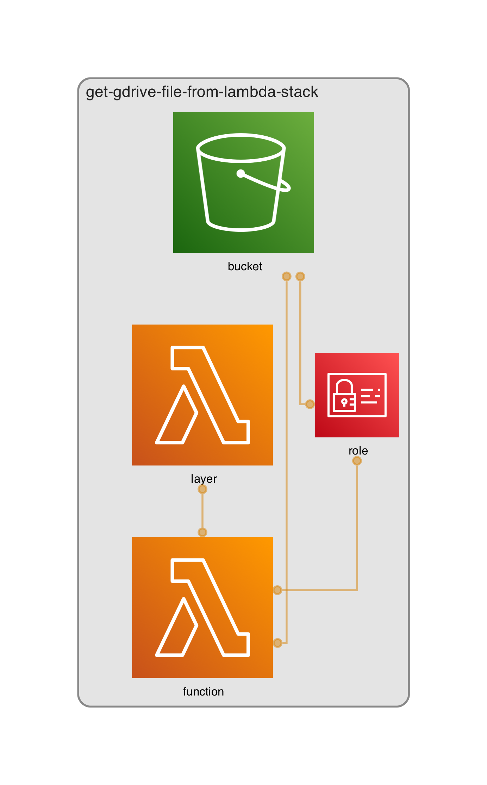
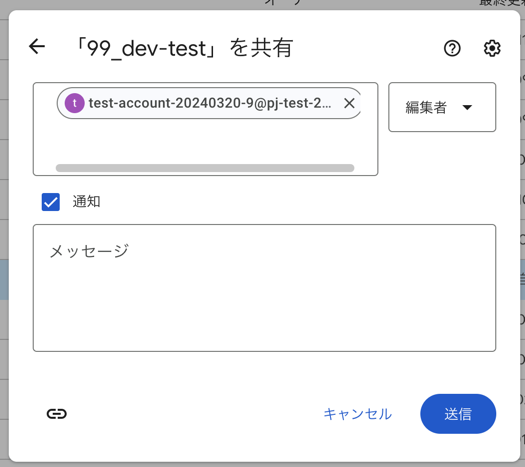

GCPのファイルをAWSにコピーするサンプルです。

# 構成



構成の出力には https://github.com/pistazie/cdk-dia を使わせて頂いてます！感謝！

# 準備

```
npm install
pip install -r requirements.txt
```

# デプロイ

- gcloud cli が導入されている前提。

**GCP側**

`gcp_setup.sh`を開いて`AWS_ACCOUNT_ID`を手持のアカウントIDに書き換えてください。

次に以下のコマンドを実行します。

```
$ sh gcp_setup.sh

# 1回の実行で成功してほしいのですが、Workload IdentityのAPIを有効化した直後に失敗して、その回避方法がわからず２回叩きます
$ sh gcp_setup.sh
```

`email`と`project_number`が出力されるので、↓の{project_number}のところの値を書き換えてブラウザでアクセスし、APIを有効化してください。

https://console.developers.google.com/apis/api/drive.googleapis.com/overview?project={project_number}

次にAWSにコピーしたいディレクトリをGoogleドライブで開きます。

このディレクトの共有設定で↑の`email`を貼り付けてアクセスできるユーザーに登録します。



またディレクトリを開くとURLが↓な感じになっているとおもいます。この`xxxxxxxxxxxxx_xxxxxxxxxxxxxxxxxxx`をコピーしておきます。

`https://drive.google.com/drive/folders/xxxxxxxxxxxxx_xxxxxxxxxxxxxxxxxxx`


**AWS側**

`app.py`を開いて`GOOGLE_DRIVE_FOLDER_ID`に先ほどコピーした`xxxxxxxxxxxxx_xxxxxxxxxxxxxxxxxxx`を貼り付けます。

```
npx cdk -a "python3 app.py" deploy
```
